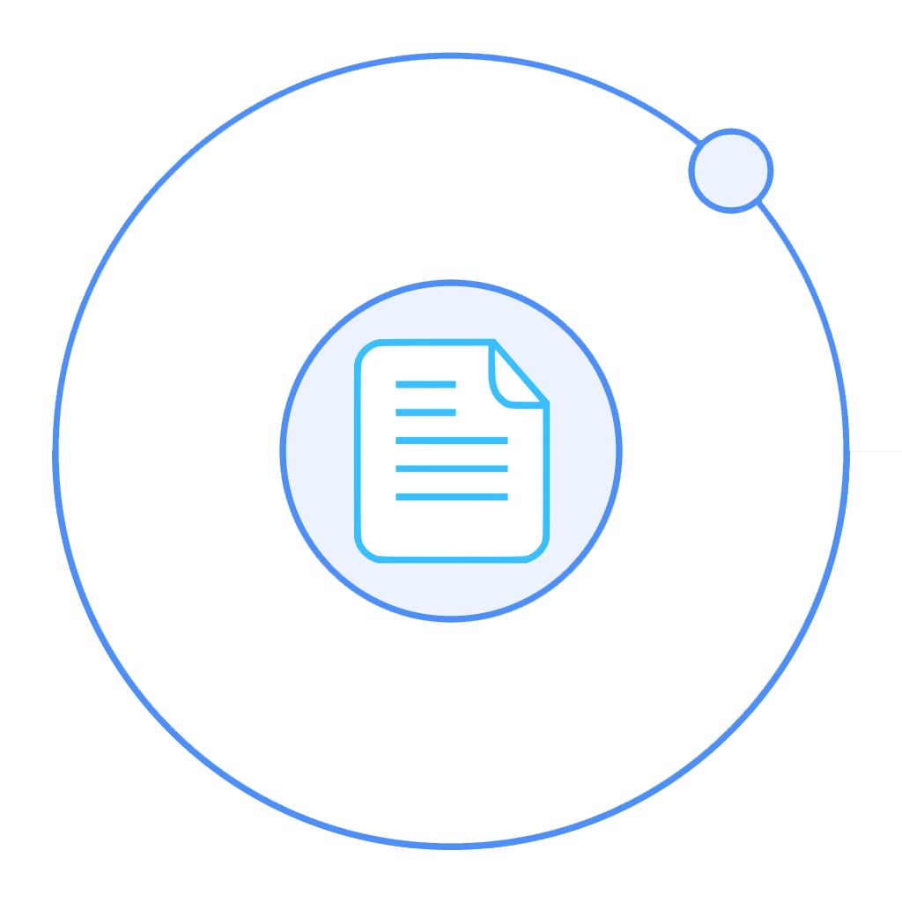

# Ionic 2 OCR Example

<p align="center">
  
</p>

[](https://www.bithound.io/github/matiastucci/ionic-ocr-example)
[](https://www.bithound.io/github/matiastucci/ionic-ocr-example/master/dependencies/npm)
[](https://www.bithound.io/github/matiastucci/ionic-ocr-example)

This is a simple Ionic 2 app using [ocrad.js](https://github.com/antimatter15/ocrad.js).

If you want an Ionic 1 version of this, you can go to the [v1](https://github.com/matiastucci/ionic-ocr-example/tree/v1) branch.

[Video Demo](https://youtu.be/TykCiS80oZc)

## Getting Started
```
$ git clone https://github.com/matiastucci/ionic-ocr-example
$ cd ionic-ocr-example
$ npm i
$ ionic state restore
$ ionic serve
```

## Plugins (using Ionic Native)
* [cordova-plugin-camera]

## Test it with Ionic View
* Download the [Ionic view] app
* Signup/login to the app
* Insert this ID: **cfe7e781**

[Ionic view]:http://view.ionic.io/
[cordova-plugin-camera]:http://ionicframework.com/docs/v2/native/camera/
